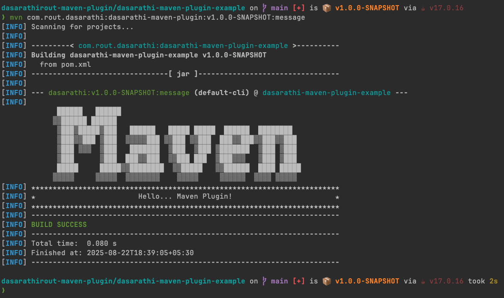
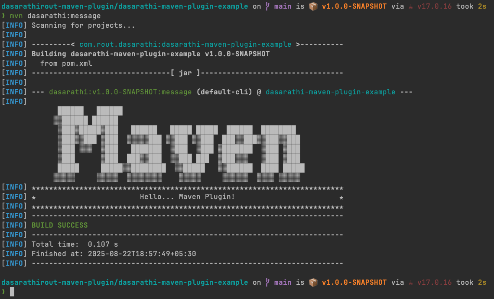
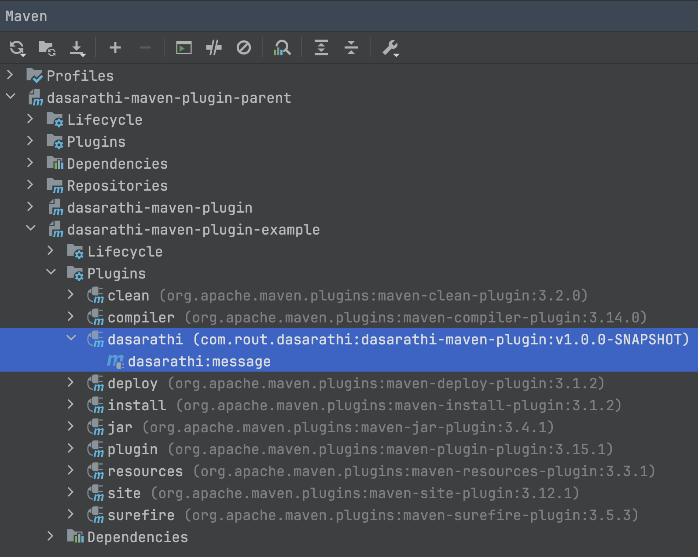

# dasarathi-maven-plugin

---

### Run Maven Command

___

#### Build & Package maven-plugin

> ``` 
> mvn clean install
> ```

#### Run maven-plugin

> ``` 
> # mvn groupId:artifactId:version:mojoName
> mvn com.rout.dasarathi:dasarathi-maven-plugin:v1.0.0-SNAPSHOT:message
> ```

#### Plugin Console Output

>
> 

#### Run maven-plugin with prefix-name

> ``` 
> # mvn prefixName:goalName
> mvn dasarathi:message
> ```

#### Plugin Console Output (with prefix-name)

>
> 

#### IDE Maven Tool Window Plugin

>
> 

***

- https://www.asciiart.eu/text-to-ascii-art
  ASCII Art Generated With Font `DOS Rebel`, Size `6 PT` 