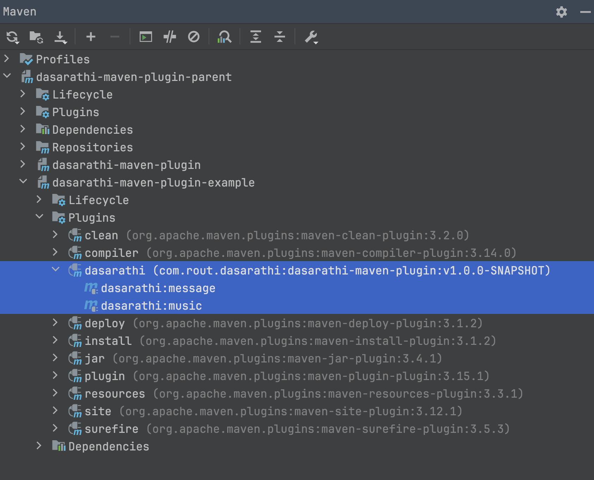

# dasarathi-maven-plugin

---

### Run Maven Command with custom ASCII Art Message & Play Music when maven build

```xml

<plugin>
    <groupId>com.rout.dasarathi</groupId>
    <artifactId>dasarathi-maven-plugin</artifactId>
    <version>v1.0.0-SNAPSHOT</version>
    <executions>
        <execution>
            <id>1-validate-message</id>
            <phase>
                validate
            </phase>
            <goals>
                <goal>message</goal>
            </goals>
            <configuration>
                <userMessage>dasarathi-mvn-3</userMessage>
            </configuration>
        </execution>
        <execution>
            <id>2-validate-music</id>
            <phase>
                validate
            </phase>
            <goals>
                <goal>music</goal>
            </goals>
            <configuration>
                <isMusicSkipped>false</isMusicSkipped>
            </configuration>
        </execution>
    </executions>
</plugin>


```

___

#### Run maven-plugin : message

> ``` 
> # mvn groupId:artifactId:version:mojoName
> mvn com.rout.dasarathi:dasarathi-maven-plugin:v1.0.0-SNAPSHOT:message
> ```

#### Plugin Console Output message

>
> 

#### Run maven-plugin : message with prefix-name

> ``` 
> # mvn prefixName:goalName
> mvn dasarathi:message
> ```

#### Plugin Console Output message (with prefix-name)

>
> 

#### IDE Maven Tool Window Plugin

>
> 

***

- AsciiArt.eu Generated With Font `DOS Rebel`, Size `6 PT`
- MP3 Ringtone from ZEDGE